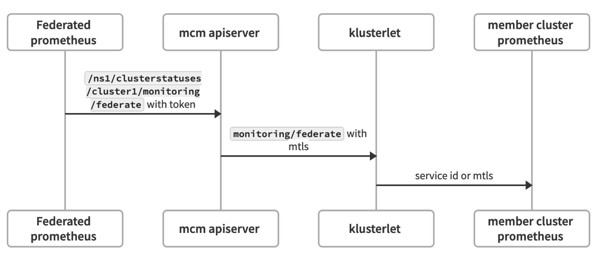

# Klusterlet Endpoint

This document is to provide unified monitoring & logging API in mcm environment.

Referring to how kubelet provide log and monitoring for each container in kubernetes, we use the same mechanism in klusterlet:

1. Start a mtls enabled http server in klusterlet to provide logging and monitoring endpoint.
2. mcm APIServer proxy any logging/monitoring calls to klusterlet
3. The 3rd party services (federated prometheus) calls mcm apiserver with id token or service account token.

The work flow of monitoring will be like below:

And the logging work flow will be like below:

To implement the above flow, we provide two subresources (`/monitoring` and `log`) in mcm apiserver under clusterstatus.

Federated prometheus only need to mount the service account token to call mcm apiserver. token refresh and calls to native prometheus only happens in klusterlet.
