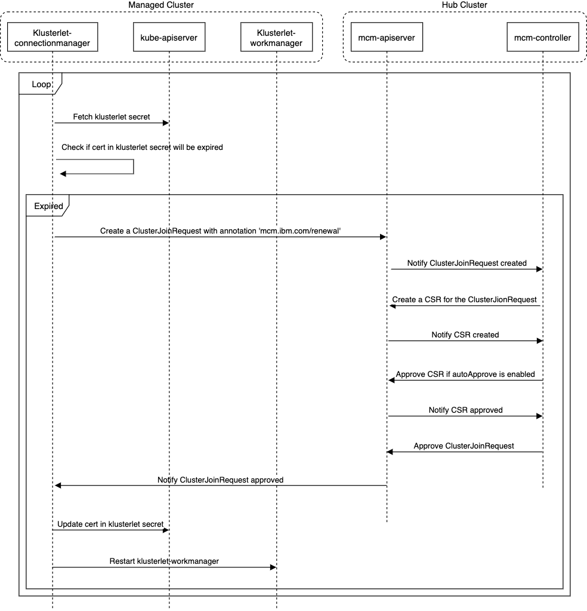

# Klusterlet Certification Renewal

Certification created for managed cluster during cluster join has an expiration date. Connection manager checks the certification periodically after it connects to a hub cluster successfully, and then renew it by creating a new ClusterJoinRequest with annotation 'mcm.ibm.com/renewal' on hub cluster before it expires. MCM controller running on hub cluster will skip cluster namespace/name checking once it finds the ClusterJoinRequest has an annotation 'mcm.ibm.com/renewal'. Just like kubelet, new private keys will be created during client certification rotation.

The diagram below shows the flow of klusterlet certification renewal in detail.
