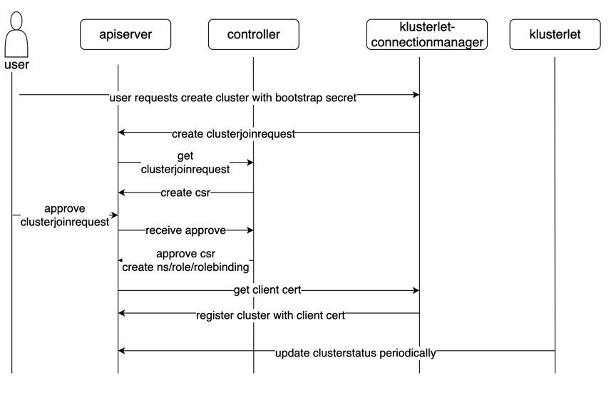

# Cluster Join Process

Mcm will constrain that one and only one cluster can be registered into a namespace (namespace for cluster). Two clusters cannot be put in the same namespace. Each cluster name must be unique globally.

When user wants to add a new managed cluster, klusterlet-connectionmanager will use bootstrap secret to create `clusterjoinrequest`, then api and controller will verify the request and return certificate if the request is approved. then klusterlet uses the certificate to talk to kube-apiserver.

The whole flow of the process will be as follows:
