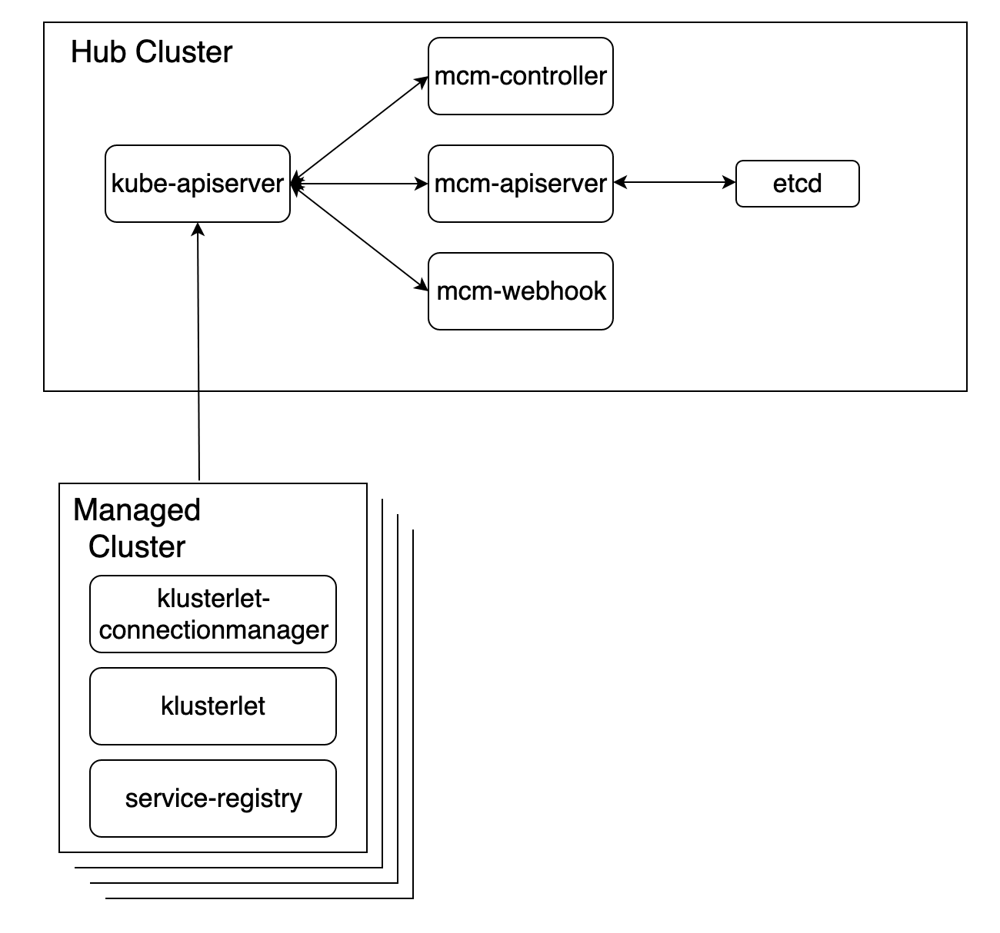

# Overview

Multicloud manager is the service to manage kubernetes clusters deployed on multiple cloud providers. There are two parts for mcm, Hub cluster and Managed cluster. The architecture is shown as below:

## Hub cluster

* mcm-apiserver: All apis in mcm-apiserver are registered on kubernetes apiserver. All requests from klusterlets and controllers will be served by kubernetes apiserver at first and then passed to mcm-apiserver.

* mcm-controller: Controller is deployed on the kubernetes cluster and used to manage the mcm resources.

* mcm-webhook: Currently, mcm-webhook is used to add user info to custom resource, which is used in RBAC.

## Managed cluster

* klusterlet: It syncs local cluster status periodically to apiserver. It is responsible for executing real work in local cluster.

* klusterlet-connectionmanager: This component is used to manage cluster join process and certificate rotation.

* serviceregistry: It is used for service discovery.
