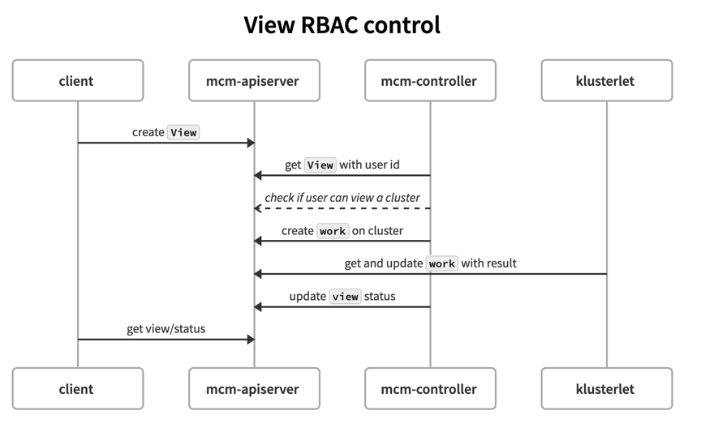
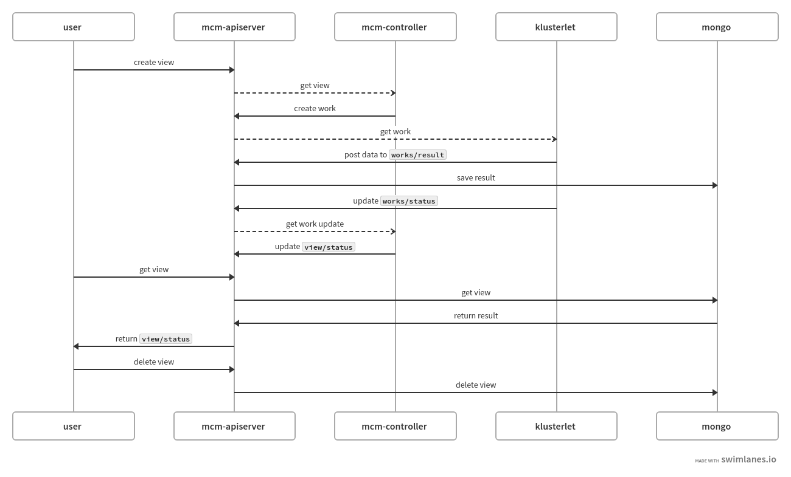

# Resource View

## Overview

Resource view is an API for user to check the resources status among multiple clusters. A user can specify `How` to check `What` resources in `View` API Spec. mcm will report and aggregate resources status from multiple clusters, and user can also get the aggregated result.
`View` can be created per user or per group, different user (or group) can have different view, and mcm will control what data will be put in a view based on their RBAC permission on clusters using subject access review.

### What Resource View Can Do

- Be able to get ANY API resources in managed k8s clusters, including user defined CRDs
- Be able to enforce RBAC, so different user will see different results when creating the same view spec.

## API Spec

```yaml
apiVersion: mcm.ibm.com/v1alpha1
kind: ResourceView
metadata:
  labels:
    name: getmasternode
  name: getmasternode
spec:
  clusterSelector:
    matchLabels:
      name: mycluster
    matchNames:
    matchConditions:
  mode: Periodic
  updateIntervalSeconds: 10
  scope:
    apiGroup: ""
    resource: pods
    fieldSelector: ""
    labelSelector:
      matchLabels:
        role: master
    namespace: default
    resourceName: “”
  summaryOnly: true

status:
  conditions: {}
  results:
  - mycluster: {pod list data}

```

In the `spec` section:

- `clusterSelector` specifies the set of clusters to get resources.
- `mode` specifies how the data in view will be updated. `Periodic` indicate that the date in this view will be updated periodically.
- `updateIntervalSeconds` specifies the time interval in seconds of data update. Only valid when mode is set to `Periodic`.
- `scope` defines the resource filter on each managed cluster to get resources.
- `summaryOnly` is a flag to let each managed cluster return resources in the format of `Table`, it will be easier for client to print data.

In `status` section:

- `conditions` specifies any error when view certain resource.
- `results` is a map in which key is the cluster name is the value returned from this cluster in `runtime.RawExtension` type.

## RBAC enforcement

When users from two different groups try to get pods on the clusters belong to the group. The view they create will be the same as below:

```yaml
apiVersion: mcm.ibm.com/v1alpha1
kind: ResourceView
metadata:
  labels:
    name: getmasternode
  name: getmasternode
spec:
  mode: Periodic
  updateIntervalSeconds: 10
  scope:
    apiGroup: ""
    resource: pods
  serverPrint: true
```

mcm-controller will check which cluster the user can visit and update the status in the view, so different users will have different view status based on their RBAC. The swimlane of this process is shown as follows:



## view scalability

If we store the resource view result in etcd is not quite scalable. Even though etcd has a relatively fast read speed, the cost of create/update operation is pretty high. In addition, etcd has the limitation that the size of the single value cannot be larger than 1MB. If a user has 100s of clusters, each of the cluster has 5000 pods. It will not be possible for etcd to store a view result when the user wants to get all pods in all managed clusters.

So, we use mongo as the backend storage for resourceview result. Mongo single value limit can be as large as 16MB, it should be enough to store result for a single cluster.

### customize apiserver storage

1. Klusterlet reports result: when the klusterlet receives the work assigned to it, it posts the result data to the subresource of `works/results` to the apiserver. API server saves the results to mongo.
2. Controller updates view status: controller does not need to read work result and copy to view. It only gets status of work and update the view status.
3. When user gets results, apiserver reads all work results relates to the view and return them back.

The swimlane is shown as below:


### Data compression

Klusterlet uses gzip to compress the data and return back to apiserver which can saves about 60% of data size.
