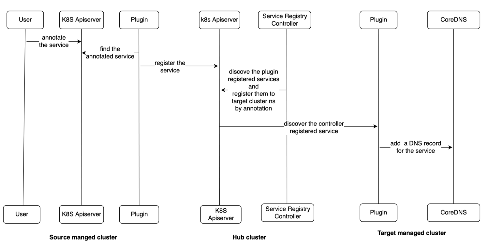

# Service Discovery

We implement the service discovery in a plugin way. The service registry plugin in each source managed cluster registers the service that has a service discovery annotation (`mcm.ibm.com/service-discovery`) to hub cluster as an endpoint, the service registry controller in the hub cluster can discovery these services and register them as endpoints in target managed cluster namespaces, then target managed clusters plugin discovery the endpoints and write a DNS record to CoreDNS, so, this service can be visited in target cluster, the swimlane of the whole process is shown as below:



## Service Discovery Annotation

The service discovery annotation `mcm.ibm.com/service-discovery` to help user to discover their services. In managed clusters, users use this annotation to annotate their services, the service registry plugin in managed cluster lists and registers the annotated services to its corresponding cluster namespace in hub cluster. In hub cluster, the service registry controller discovers these services and register them as endpoints to target managed cluster namespace by the configuration of this annotation.

The service discovery annotation can be defined as:

```yaml
mcm.ibm.com/service-discovery: '{"target-clusters": ["clutser1", "cluster2"], "dns-prefix": "http.svc"}'
```

The annotation has two optional fields:

- `target-clusters`, an array list for cluster name, if this field does not set or its value is empty, the hub service registry controller will use all managed clusters as the target clusters, if this field is set, the controller will use the value of this field as the target clusters, the controller will register the annotated services as endpoints in every target managed cluster namespace
- `dns-prefix`, a string with domain name format, this field is used to rename the Kubernetes services, if this field does not set or its value is empty, the target managed clusters plugin will use `<service-name>.<service-namespace>.<dns-suffix>` as a DNS record for a discovered service, if this field is set, the target managed clusters plugin will use `<dns-prefix>.<dns-suffix>` as a DNS record for a discovered service

## DNS Records

In each target managed cluster, the service registry plugin creates DNS records and writes them to CoreDNS for discovered services, these service DNS records have an unified DNS suffix, by default, the suffix is `mcm.svc`, user can use serviceregistry `--dns-suffix` option to change it.

If the `dns-prefix` field in service discovery annotation does not set, the discovered services will have two types DNS records

- `<service-name>.<service-namespace>.<dns-suffix>`
- `<service-name>.<service-namespace>.<source-cluster>.<dns-suffix>`

If the `dns-prefix` field in service discovery annotation is set, the discovered services will have two types DNS records

- `<dns-prefix>.<dns-suffix>`
- `<dns-prefix>.<source-cluster>.<dns-suffix>`

## Plugins

Currently, we support to discover Kubenetes service, Kubenetes ingress and Istio services among managed clusters, the corresponding plugins are

- kube-service
- kube-ingress
- istio

these plugins can be enabled or disable by serviceregistry `--plugins` option, the value of this option is comma-separated list of enabled plugins,e.g. if you want to discover all type services, you can set the option to `--plugins=kube-service,kube-ingress,istio`, if you just want to discover Kubenetes service, you can set the option to `--plugins=kube-service`

## An Example

Assume we have three clusters: cluster1, cluster2, and cluster3. The user wants to create a service on cluster1 and wants it to be discovered in cluster2 and cluster3.

1. User create a service with the service discovery annotation

    ```yaml
    apiVersion: v1
    kind: Service
    metadata:
      annotations:
        mcm.ibm.com/service-discovery: "{}"
      name: httpbin
      namespace: test
    spec:
      type: LoadBalancer
      ports:
      - name: http
        nodePort: 8080
        port: 8000
        protocol: TCP
      selector:
        app: httpbin
    ```

2. plugin on cluster1 discovers this annotated service and register it as an endpoint to its cluster namespace (`cluster1ns`) in hub cluster

    ```yaml
    apiVersion: v1
    kind: Endpoints
    metadata:
      annotations:
        mcm.ibm.com/service-discovery: "{}"
      labels:
        mcm.ibm.com/service-type: "kube-service"
        mcm.ibm.com/cluster: cluster1
      name: kube-service.httpbin.test
      namespace: "cluster1ns"
    subsets:
    - addresses:
      - ip: "9.111.254.168"
      ports:
      - name: http
        port: 8080
        protocol: TCP
    ```

3. in hub cluster, the service registry controller will find this endpoint and register it as a discovered endpoint to each managed cluster namespace (`cluster2ns` and `cluster3ns`)

    ```yaml
    apiVersion: v1
    kind: Endpoints
    metadata:
      labels:
        mcm.ibm.com/service-type: kube-service
        mcm.ibm.com/auto-discovery: true
      name: cluster1.kube-service.httpbin.test
      namespace: cluster2ns
    subsets:
    - addresses:
      - ip: 9.111.254.168
      ports:
      - name: http
        port: 8080
        protocol: TCP

    apiVersion: v1
    kind: Endpoints
    metadata:
      labels:
        mcm.ibm.com/service-type: kube-service
        mcm.ibm.com/auto-discovery: true
      name: cluster1.kube-service.httpbin.test
      namespace: cluster3ns
    subsets:
    - addresses:
      - ip: 9.111.254.168
      ports:
      - name: http
        port: 8080
        protocol: TCP
    ```

4. plugin in cluster2 and cluster3 will find the discovered endpoint in its cluster namespace on hub cluster, then add the service DNS records in its cluster. Finally, in each target managed cluster, the cluster1 `httpbin` service can be visited with domains:

    - `httpbin.test.mcm.svc`
    - `httpbin.test.cluster1.mcm.svc`

5. When the service is moved from cluster1 to cluster2, the plugin will reconfigure the dns so pods in cluster2 and cluster3 still can use the fqdn to visit service

    - `httpbin.test.mcm.svc`
    - `httpbin.test.cluster2.mcm.svc`

6. If the service is created in two clusters. The fqdn will include the name to visit the service in each cluster.

    - `httpbin.test.mcm.svc`
    - `httpbin.test.cluster1.mcm.svc`
    - `httpbin.test.cluster2.mcm.svc`

### Locality

If there is already an `httpbin` service in the cluster under the `test` namespace. Based on dns search rule, the local service will be found at first by name of `httpbin.test`. If DNS suffix (`mcm.svc`) is added to the DNS search domain list and the local service is moved from the cluster, pod can get `httpbin.test` via `httpbin.test.mcm.svc`.

The search order of the domain name `httpbin.test` will be:

- `httpbin.test.svc.cluster.local`
- `httpbin.test.mcm.svc`
