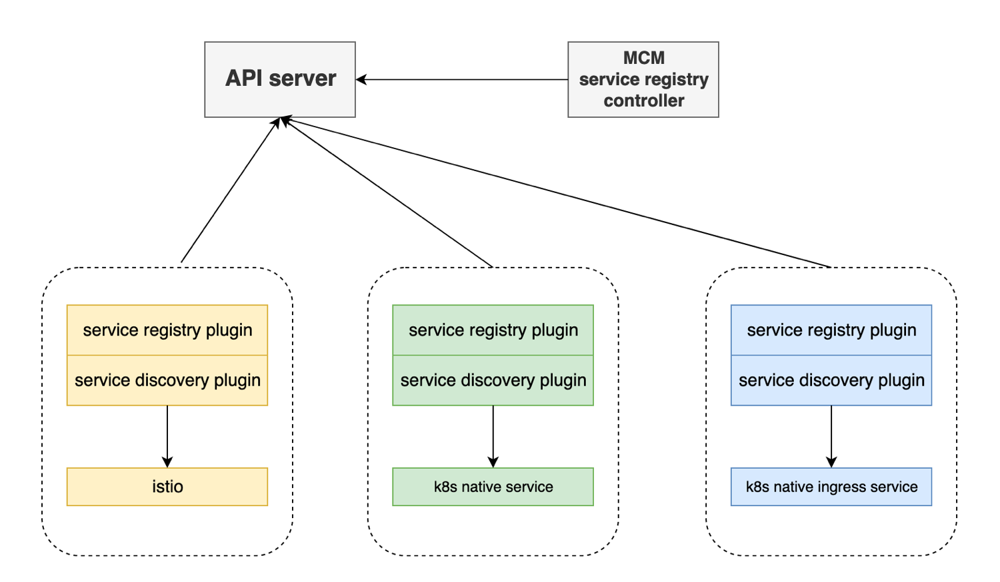

# MCM Service Discovery

We implement the service management in a plugin way. Each managed cluster can register its service to hub cluster by adding an annotation, service registry controller can register these services as an endpoint in target managed cluster namespaces. Then target clusters plugin discovery the endpoint and write a dns record to CoreDNS. So, this service can be visited in target cluster.



## Service Discovery Annotation

We introduce an annotation `mcm.ibm.com/service-discovery` to help user to discover their service，the annotation can be defined as below:

```yaml
mcm.ibm.com/service-discovery: '{"dns-prefix": "http.svc", "target-clusters": ["clutser1", "cluster2"]}'
```

The annotation has two optional fields: one is `dns-prefix`, another is `target-clusters`. In managed clusters, user uses this annotation to annotate their service, then the service registry plugin finds and registers the annotated service to its corresponding cluster namespace in hub cluster. In hub cluster, by default, the service registry controller discovers the same type registered services with the same service name and register the services as an endpoint in every managed cluster namespace. if the `dns-prefix` annotation is set, the controller discovers the same type registered services with this annotation, if the `target-clusters` is set, the controller uses these managed clusters as the target clusters, or the controller will use all clusters as target clusters.

### An Example

Assume we have three clusters: cluster1, cluster2, and cluster3. The user wants to create a service on cluster1 and wants it to be discovered in cluster2 and cluster3.

1. User create a service with special annotation

    ```yaml
    apiVersion: v1
    kind: Service
    metadata:
      annotations:
        mcm.ibm.com/service-discovery: "{}"
      name: httpbin
      namespace: test
    spec:
      type: LoadBalancer
      ports:
      - name: http
        nodePort: 8080
        port: 8000
        protocol: TCP
      selector:
        app: httpbin
    ```

2. plugin on cluster1 discovers this annotated service and register it as an endpoint to its cluster namespace (`cluster1ns`) in hub cluster

    ```yaml
    apiVersion: v1
    kind: Endpoints
    metadata:
      annotations:
        mcm.ibm.com/service-discovery: "{}"
      labels:
        mcm.ibm.com/service-type: "kube-service"
        mcm.ibm.com/cluster: cluster1
      name: registered-endpoint
      namespace: "cluster1ns"
    subsets:
    - addresses:
      - ip: "9.111.254.168"
        hostname: httpbin.test
      ports:
      - name: http
        port: 8080
        protocol: TCP
    ```

3. in hub cluster, the service registry controller will find this endpoint and register it as a discovered endpoint to each managed cluster namespace (`cluster2ns` and `cluster3ns`)

    ```yaml
    apiVersion: v1
    kind: Endpoints
    metadata:
      labels:
        mcm.ibm.com/service-type: kube-service
        mcm.ibm.com/auto-discovery: true
      name: discovered-endpoint
      namespace: cluster2ns
    subsets:
    - addresses:
      - ip: 9.111.254.168
        hostname: httpsvc.test
      ports:
      - name: http
        port: 8080
        protocol: TCP

    apiVersion: v1
    kind: Endpoints
    metadata:
      labels:
        mcm.ibm.com/service-type: kube-service
        mcm.ibm.com/auto-discovery: true
      name: discovered-endpoint
      namespace: cluster3ns
    subsets:
    - addresses:
      - ip: 9.111.254.168
        hostname: httpsvc.test
      ports:
      - name: http
        port: 8080
        protocol: TCP
    ```

4. plugin in cluster2 and cluster3 will find the discovered endpoint in its cluster namespace on hub cluster, then add the service DNS records in its cluster. Finally, in each target managed cluster, the cluster1 `httpbin` service can be visited with domains:

    - `httpbin.test.mcm.svc`
    - `httpbin.test.cluster1.mcm.svc`

5. When the service is moved from cluster1 to cluster2, the plugin will reconfigure the dns so pods in cluster2 and cluster3 still can use the fqdn to visit service

    - `httpbin.test.mcm.svc`
    - `httpbin.test.cluster2.mcm.svc`

6. If the service is created in two clusters. The fqdn will include the name to visit the service in each cluster.

    - `httpbin.test.mcm.svc`
    - `httpbin.test.cluster1.mcm.svc`
    - `httpbin.test.cluster2.mcm.svc`

### Locality

If there is already an `httpbin` service in the cluster under the `test` namespace. Based on dns search rule, the local service will be found at first by name of `httpbin.test`. If DNS suffix (`mcm.svc`) is added to the DNS search domain list and the local service is moved from the cluster, pod can get `httpbin.test` via `httpbin.test.mcm.svc`.

The search order of the domain name `httpbin.test` will be:

- `httpbin.test.svc.cluster.local`
- `httpbin.test.mcm.svc`

The swimlane of the whole process is shown as below:


